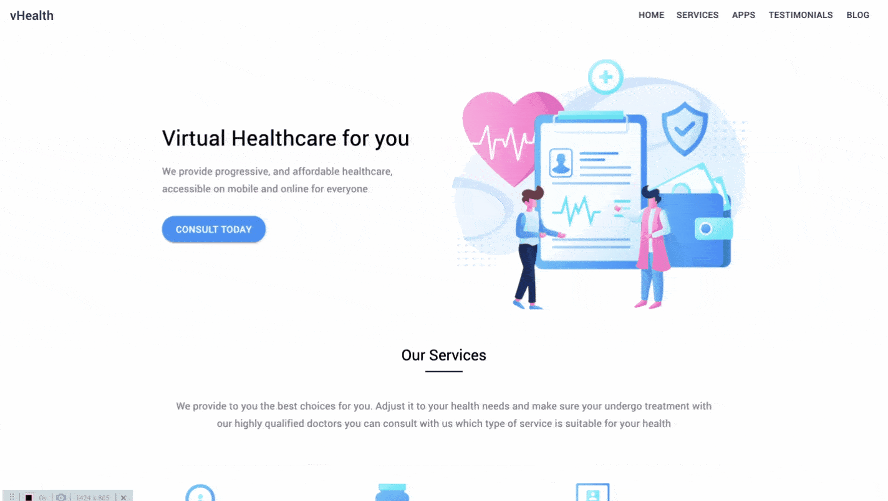

<h1 align="center">
  vHealth
</h1>

Open Source web template for a Healthcare Startup. It's built using gatsby but can be easily ported to create-react-app.

## Preview



[See Live Preview >> ](https://vhealth.openthemes.dev)

## 🚀 Get Up and Running in 5 Minutes

1. **Install the Gatsby CLI.**

   ```bash
   npm install -g gatsby-cli
   ```

2. **Download and install dependencies.**

   Clone this repo and install required dependencies:

   ```bash
   git clone https://github.com/shantanu-deshmukh/vhealth-gatsby.git
   cd vhealth-gatsby
   yarn install
   #or `npm install` if you prefer npm
   ```

3. **Start the site in `develop` mode.**

   Start the site in develop mode and make changes as per your requirement

   ```bash
   gatsby develop
   ```

4. **Deploy**

   Just build and deploy the `public` directory to a service that serves HTML pages.

   ```bash
   gatsby build
   ```

